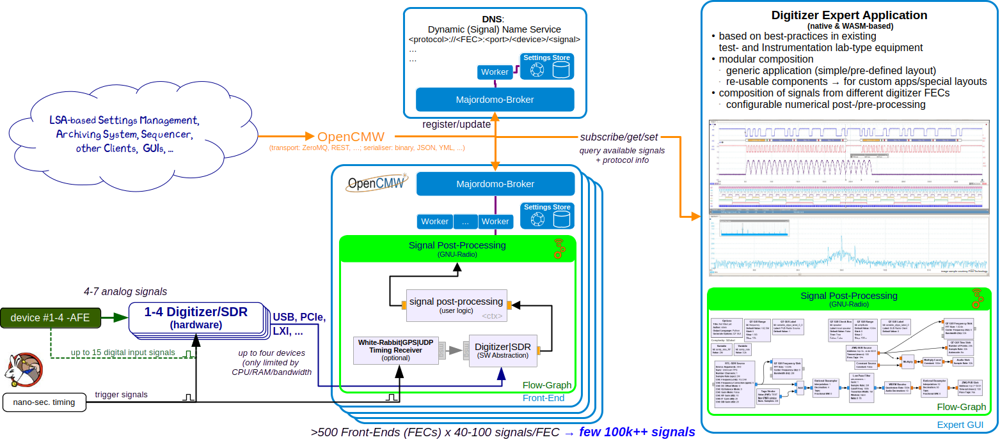

# OpenDigitizer

OpenDigitizer is an open-source project modernising FAIR’s time- and frequency-domain digitizer infrastructure embracing
modern C++20 standards and uses the [OpenCMW](https://github.com/fair-acc/opencmw-cpp), [GNU Radio](https://www.gnuradio.org/)
([version 4.0](https://github.com/fair-acc/gnuradio4)), [ImGUI](https://github.com/ocornut/imgui)
and [WebAssembly](https://webassembly.org/) ecosystems.

While initially designed for the FAIR facility, the expressed intent is to be highly adaptable also for use by other
research facilities, industry, academia, as well as private users.



The primary applications of OpenDigitizer include:

- First-line diagnostics and fault identification, serving as a distributed diagnostic tool for accelerator equipment
  with nanosecond-level synchronization, offering functionalities similar to oscilloscopes, software-defined-radios,
  spectrum analyzers, VNAs, and other hardware.
- Providing building blocks for higher-level diagnostics and monitoring tools, assisting equipment experts, operators,
  and scientist in developing basic to advanced top-level diagnostics and feedback control loops
- Supporting a rapid prototyping R&D environment for quick adaptation, testing, and integration of solutions developed
  on lab test stands or during machine studies into the 24/7 operation of the facility.

## Key Components

The key components are:

- [OpenCMW](https://github.com/fair-acc/opencmw-cpp), an open-source middleware solution developed at GSI and FAIR
  providing flexible data transport, efficient data serialisation, and intuitive domain objects based on compile-time reflection
- [GNU Radio](https://www.gnuradio.org/) ([version 4.0](https://github.com/fair-acc/gnuradio4)), a powerful
  software toolkit designed for signal processing and software-defined radios. GNU Radio uses directed signal flow graphs
  for efficient expression of post-processing and feedback control loop logic. This feature makes it easy for domain
  experts with minimal programming experience to inspect and reconfigure existing systems, while at the same time keeping
  the internal C++ components clean, lean, and maintainable by RSE experts.
- [ImGUI](https://github.com/ocornut/imgui) and [WebAssembly](https://webassembly.org/) (WASM, through Emscripten) are
  used for the user interfaces, enabling cross-platform compatibility, and native deployment on the desktop, mobile,
  as well as other browser-based platforms supporting flexible use during commissioning and troubleshooting.

## Building

Follow these instructions in the subdirectories to compile the individual parts of the project.
The top-level CMakeList can be used to compile the complete project in one go:

```shell
cmake -S . -B build -DEMCMAKE_COMMAND=`which emcmake` && cmake --build build
```

This will compile the native UI, the WebAssemblyUI (in a subbuild), and the service which includes the wasm artifacts in its
assets.

## Running

Running the service for webassembly UI

```shell
cmake --build . --target run-opendigitizer
xdg-open https://localhost:8443/web/index.html # launches the webassembly UI
xdg-open https://localhost:8443/flowchart      # launches the html based web ui for the flowgraph property
xdg-open https://localhost:8443/acquisition    # launches the html based web ui for the acquisition property
```

Running the native digitizer UI

```shell
build/src/ui/opendigitizer-ui
```

## Sustainable, FAIR, Clean- and Lean- Principles

We are committed to:

1. **Clean & Lean Code** (Muda 無駄 & Kaizen 改善 )

   Boost maintainability and adaptability through concise, modular code, eliminating waste and fostering continuous improvement

2. **Test-Driven & Extreme Programming**

   Ensure software reliability, accelerate, and keep developing applications fit-for-purpose

3. **Bus Factor & Knowledge Distribution**

   Foster collaborative environments and respect for people to enhance team resilience by sharing knowledge and responsibilities

4. **FAIR Principles**
   (see [here](https://en.wikipedia.org/wiki/FAIR_data) and [here](https://www.gsi.de/en/work/forschung/open-science) for details)

   Improve the discoverability, accessibility, interoperability, and reusability of digital assets, benefiting the
   research community and wider public through standardisation

5. **Automation & Efficiency**

   Streamline processes and improve productivity with continuous integration/deployment, optimising resource usage and
   promoting continuous improvement

6. **Scalability & Resource Optimisation**

   Ensure software longevity and efficient resource usage by designing with future growth in mind, eliminating waste, and
   optimizing delivery

7. **Security & Long-Term Planning**

   Safeguard data and software by prioritizing security, while fostering sustainable development through long-term planning
   and continuous improvement

8. **Develop People & Teams**

   Capitalise on the inverse of 'Conway's Law' by nurturing skilled engineers, create opportunities for experimentation,
   inspiring and guiding them towards sound solutions, allowing them to continuously adapt organisational structures that
   support producing better technical outcomes

## References

- [Digitization of Analog Signals](https://edms.cern.ch/document/1823376/1)
- OpenCMW [repo](https://github.com/fair-acc/opencmw-cpp/) and [specification](https://edms.cern.ch/document/2444348/1)
