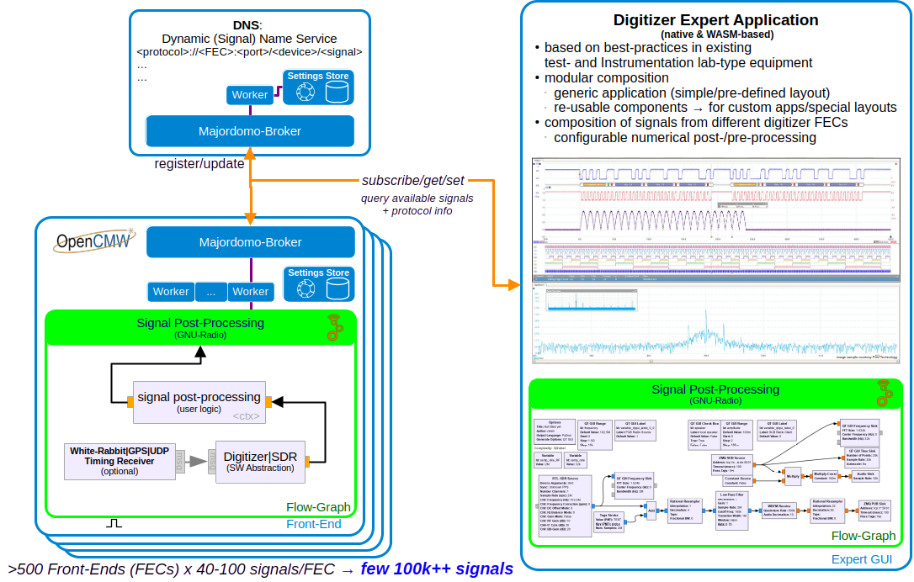

# OpenDigitizer

Generic Digitizer Framework based on OpenCMW

Integration of time-domain digitizers based upon and using the OpenCMW and GNU Radio frameworks, notably the
operational full-vertical stack integration of the existing digitizer infrastructure and generic digitizer
graphical user interface [1-5]. These and other systems based upon them shall provide generic
monitoring and first-line diagnostics capabilities for accelerator-related devices in order to support
equipment experts, operation, and FAIR users in their development of top-level measurement and control systems.




## Contents

The project consists of two parts:

- a UI part
  - which can be compiled either as a native UI application or as a WebAssembly binary
  - shows an imGUI/imPlot based view
    - empty start frame
    - imPlot wasm sample for testing
- and a service part which provides different services
  - flowgraph worker: provides access to a string property which provides the current flowgraph configuration and is
    initialized with a static default flowgraph.
    Later on, changes to the flowgraph will have to trigger updating the running flowgraph.
  - acquisition worker: provides access to an Acquisition property, which provides the signals shown in the UI. For now
    it will provide generated mock data.
    Later this should provide the data from the running flowgraph.
  - REST worker: provides access over HTTP to:
    - the aforementioned MDP properties (flowgraph and acquisition) via REST/Json
    - a simple web UI for the properties
    - the WebAssembly binary and assets as static assets served at a specific URI.

## Building

Follow these instructions in the subdirectories to compile the individual parts of the project.
The top-level CMakeList can be used to compile the complete project in one go:

```shell
cmake -S . -B build && cmake --build build
```

This will compile the native UI, the WebAssemblyUI (in a subbuild), and the service which includes the wasm artifacts in its
assets.

## Running

```shell
build/service/opendigitizer-service &         # launches the service
# build/ui/opendigitizer_ui &                 # launches the native digitizer UI (not yet implemented)
xdg-open http://localhost:8080/web/index.html # launches the webassembly UI
xdg-open http://localhost:8080/flowchart      # launches the html based web ui for the flowgraph property
xdg-open http://localhost:8080/acquisition    # launches the html based web ui for the acquisition property
```

## References

- [Digitization of Analog Signals](https://edms.cern.ch/document/1823376/1)
- OpenCMW [repo](https://github.com/fair-acc/opencmw-cpp/) and [specification](https://edms.cern.ch/document/2444348/1)
